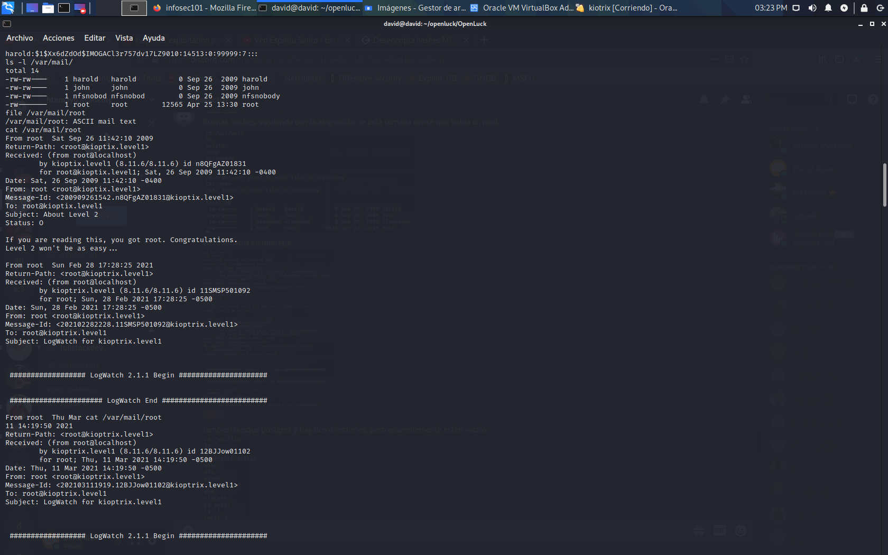
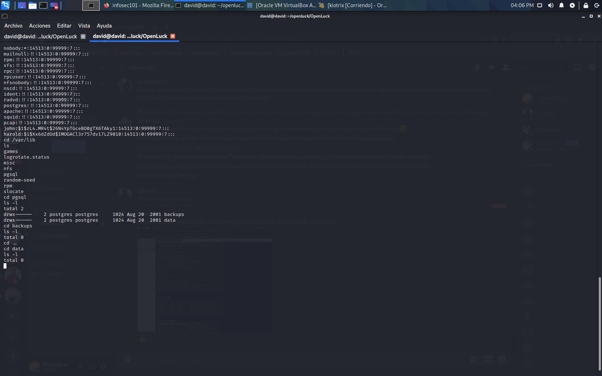

# Reporte
 
# Vulnerabilidad 
Openluck

Kioptrix nivel 1 
# Descripcion 
SSL es una tecnología estandarizada que permite cifrar el tráfico de datos entre un navegador web y un sitio web (o entre dos servidores web), protegiendo así la conexión. Esto impide que un hacker pueda ver o interceptar la información que se transmite de un punto a otro, y que puede incluir datos personales o financieros.
Si aparecen las letras HTTPS al principio de la dirección (URL) de un sitio web, dicho sitio está protegido por un certificado SSL o TLS. Además, en la barra de direcciones del navegador aparece un icono de un candado y, al hacer clic sobre ese icono, los usuarios pueden consultar los datos del certificado, como la autoridad emisora y el nombre de la empresa propietaria del sitio web.

# Elementos con los que se trabajo 
Máquina virtual virtualvox kioptrix lvl 1

# Reproduccion
1-	por medio de la terminal podemos encontrar la ip para conectarnos con kioptrix
Esto lo podemos encontrar con el comando supo arp-scan -l.

2-	Posteriormente en este paso es donde se procede a escalar, utilizando el primer dato que es la ip para así poder obtener el puerto que se encuentre abierto.

3-	Luego podemos dar inicio a nuestro ataque

4- comprometer los datos del obtenidos

# Impacto
el atacante ya tiene acceso a la informacion del sitio web ya que con la vulnerabilidad y privilegios ha podido obtener la informacion 
y con esto poder tenes los datos personales ya sea usuarios, bases de datos, contraseñas, etc.

# mitigacion 
1- tener certificado SSL

2- configurar la red vpn 

3- Configurar un archivo .htaccess para evitar inyectar enrutamientos.

# Referencias 
https://md5.gromweb.com/?string=%241%24zL4.MR4t%2426N4YpTGceBO0gTX6TAky1

https://nvd.nist.gov/vuln/detail/CVE-2003-0201

https://github.com/heltonWernik/OpenLuck

# POC

